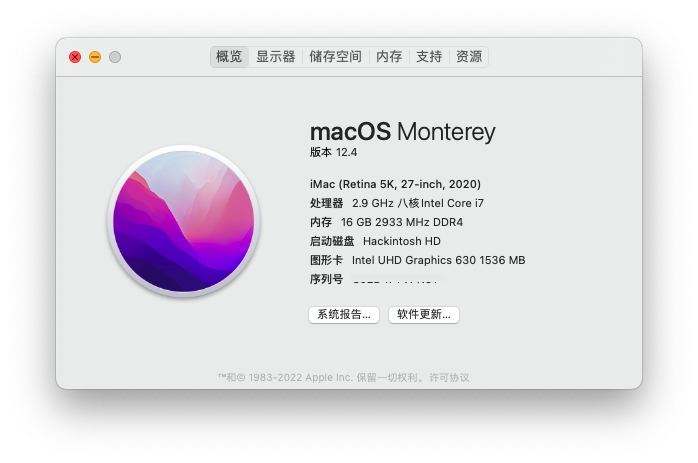

# DELL Optiplex 5080 黑苹果



基于OpenCore 0.7.8

三码已经清空，请自行生成三码填入。

## 硬件配置

* CPU: Intel® Core™ i7-10700 处理器
* 核显: Intel® UHD Graphics 630
* 内存: 16GB DDR4 2666 单通道
* 固态硬盘: 闪迪 Ultra 3D SATA SSD 1TB
* Wi-Fi & 蓝牙: 暂无
* 声卡: Realtek ALC256

### 正常工作
* CPU 睿频
* 核显加速
* 绝大部分 USB 接口（已定制USB）
* 有线网
* 内置扬声器 & 前后面板耳麦一体接口（麦克风功能需要额外软件支持）
* 休眠

### 不能正常工作
* 后背板最左边的USB 3.0接口的3.0功能（受限于macOS的USB端口数量限制）
* 无线网络相关功能因无网卡暂时未测试

## BIOS设置
* System Configuration → SATA Operation: AHCI
* Secure Boot → Secure Boot Enable: Disabled
* Intel® Software Guard Extensions™ → Intel® SGX™ Enable: Disabled
* Power Management → Block Sleep: check
* Virtualization Support → VT for Direct I/O: uncheck

### 未出现在BIOS设置页面的配置

需要使用 [Modified Grub Shell](https://github.com/datasone/grub-mod-setup_var) 设置以下BIOS设置项：

* 设置预分配 DVMT 为 64M。该设置项默认为 32M。
* 禁用 CFG 锁。禁用后可将 config.plist 中 ```Kernel->Quirks->AppleXcpmCfgLock``` 设为False。

## 其他修改

* 由于笔者使用一个DP转HDMI的转接口，因此缓冲帧配置中使用了HDMI的接口类型。如果你使用原生的DP输出，请修改为DP的接口类型。
* 针对Q470芯片组DP音频输出问题，修改了 AppleALC。若要更新 AppleALC，请在更新后手动为 AppleALC 打补丁，方法参见[此处](https://bbs.pcbeta.com/forum.php?mod=viewthread&tid=1889263)。